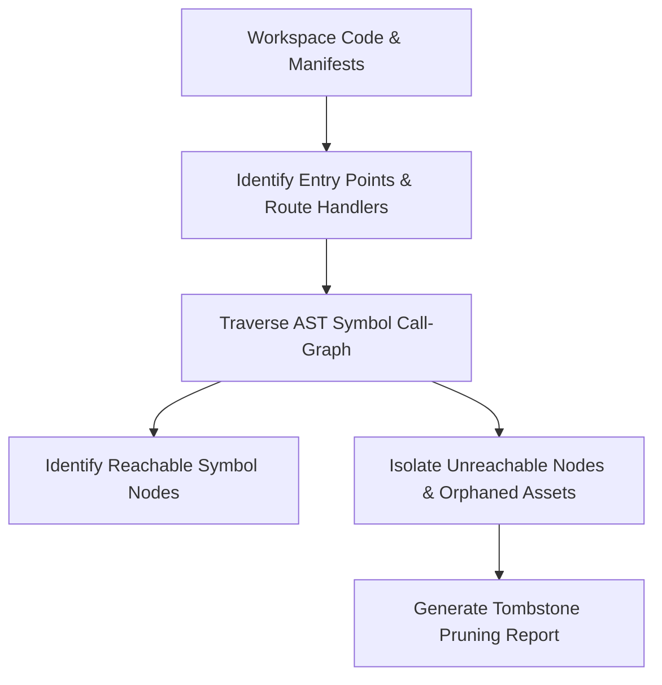

# 🪦 Tombstone

**Dead Code & Asset Bloat Hunter.** Tombstone audits multi-gigabyte codebases to detect unreachable code paths, unused module exports, orphaned npm/cargo dependencies, and legacy binary assets.

## Golden Rules
1. **Entry-Point Root Reachability**: Construct call-graphs starting from declared entry points (`main.go`, `index.ts`, route handlers); symbols with zero reachability path are dead code candidates.
2. **Export-Import Signature Matrix**: Cross-reference all declared module exports against import AST references across the workspace.
3. **Safe Pruning Gate**: Flag dead code as candidate sets for verification via `smith` codemods and `forge` test suites before physical deletion.

## ️ Architecture & Pipeline



## Usage Guide

### 1. Audit Unused Code & Assets
```bash
node lib/tombstone.js --dir "."
```

### 2. Output
Generates `tombstone-pruning-report.md` containing:
* List of Dead Export Symbols & Unreachable Files
* Orphaned Package Dependencies
* Estimated Byte Savings & Cleanup Script


---

## Spark Breakthrough Enhancement

- **Feature**: **Zero-Risk Dead Asset Cleaner**
- **Description**: Identifies unreferenced symbols and unused binary assets for pruning.
- **Synergy**: Integrated with `bonsai` (minimalism) & `smith` (refactoring).
- **Framework**: Applied via the `spark` 4-Lens Lateral Ideation Engine.


## When to use

- Primary domain workflow execution as specified in frontmatter description.


## When NOT to use

- Tasks outside declared skill scope or handled by specialized sibling skills.
